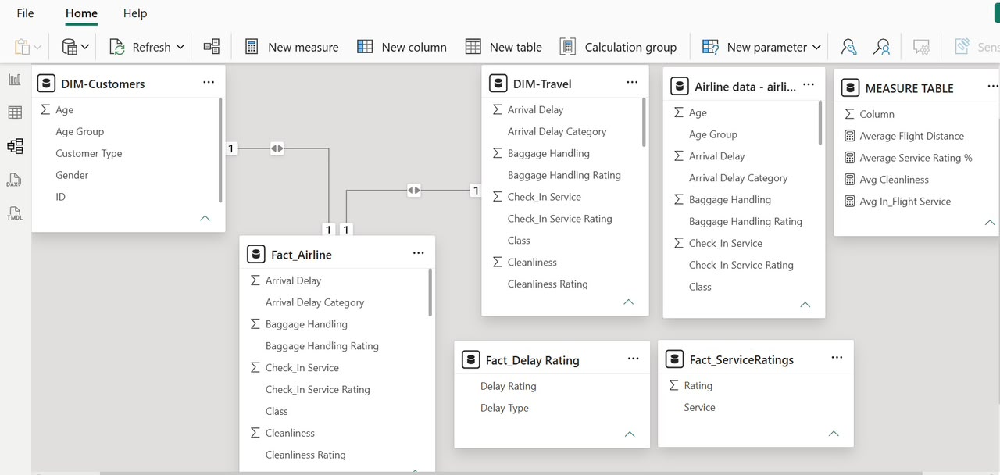
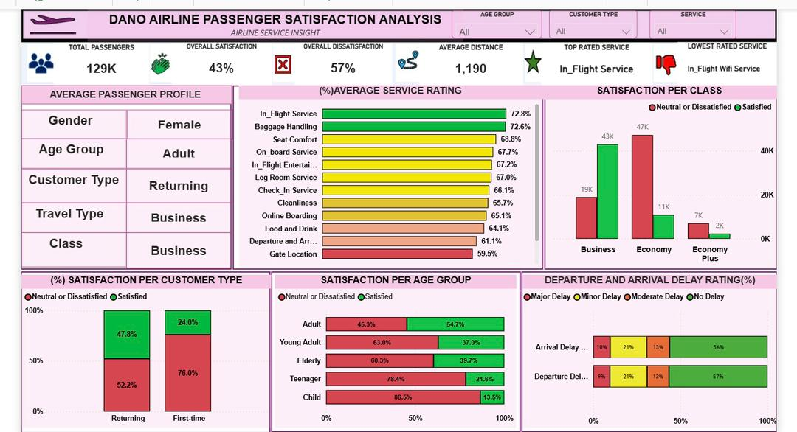

# ✈️ Dano Airline - Passenger Satisfaction Analysis

## Project Overview

This project analyzes airline passenger satisfaction data using Microsoft Power BI. The objective was to identify the key factors influencing passenger dissatisfaction and provide actionable insights to improve customer experience and operational performance.

---

## Business Problem

Airlines need to understand the drivers of passenger dissatisfaction to improve service quality, customer loyalty, and operational efficiency. This project explores passenger demographics, travel characteristics, service ratings, and delays to uncover patterns that influence customer satisfaction.

---

## Objectives

- Analyze passenger satisfaction levels.
- Identify factors influencing customer satisfaction.
- Examine the impact of travel class and customer type.
- Evaluate the effect of flight delays on satisfaction.
- Build an interactive Power BI dashboard for business users.

---

## Tools Used

| Tool | Purpose |
|------|----------|
| Power BI | Dashboard Development |
| Power Query | Data Cleaning |
| DAX | Calculations and KPIs |
| Excel | Data Source |
---

## Dataset

The dataset contains passenger information including:

- Passenger demographics
- Travel class
- Customer type
- Flight distance
- Flight delays
- Service ratings
- Overall satisfaction

---

## Data Cleaning

The following data preparation steps were performed:

- Removed duplicates
- Handled missing values
- Standardized categorical variables
- Created age groups
- Categorized delay durations
- Created calculated columns
- Built a star schema data model
- Checked data quality

---

## Data Model

A star schema was created to improve performance and simplify analysis.



---

## Dashboard

The interactive Power BI dashboard provides insights into passenger satisfaction, service quality, customer demographics, and operational performance.



---

## Key Performance Indicators

- Overall Passenger Satisfaction
- Average Service Rating
- Satisfaction by Travel Class
- Satisfaction by Customer Type
- Satisfaction by Age Group
- Departure Delay Rating
- Arrival Delay Rating

---

## Key Insights

- Only 43% of passengers were satisfied.
- Business Class passengers reported the highest satisfaction.
- First-time customers showed significantly lower satisfaction than returning customers.
- Inflight WiFi received the lowest service rating.
- Economy Class presented the greatest opportunity for improvement.
- Moderate and major delays negatively affected customer experience.

---

## Recommendations

- Improve Inflight WiFi reliability.
- Enhance the Economy Class experience.
- Improve services for first-time passengers.
- Reduce operational delays.
- Continue investing in high-performing services.

---

## Repository Structure

```
Dano-Airline-Passenger-Satisfaction-Analysis/
│
├── Dashboard/
│   └── Amanda Jubin-Fofie_Airline data.pbix
│
├── Data/
│   └── airline_passenger_satisfaction.csv
│
├── Images/
│   ├── dashboard.png
│   ├── 
│
├── Report/
│   └── Airline Passenger Satisfaction Analysis.pdf
│
└── README.md
```

---

## Author

**Amanda Jubin-Fofie**

Registered Clinical Dietitian | Aspiring Healthcare Data Analyst

Power BI • SQL • Excel • Data Analytics


